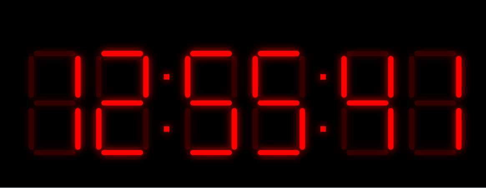

# 7-Segment Display Clock (Vite + React + TypeScript)

A digital clock built with React and TypeScript, powered by [Vite](https://vitejs.dev/). Each digit is rendered using a custom 7-segment display component—no images or SVGs, just pure HTML/CSS magic and React’s state management.



## Table of Contents

- [Features](#features)
- [Getting Started](#getting-started)
- [Project Structure](#project-structure)
- [Usage](#usage)
- [Contributing](#contributing)
- [License](#license)

---

## Features

- **7-Segment Digit Mapping**  
  Automatically lights up the correct segments for numbers `0-9`.
- **Real-Time Clock Updates**  
  Uses an interval to fetch the current time every second.
- **TypeScript**  
  Ensures type safety and cleaner, more maintainable code.

---

## Getting Started

1. **Clone the Repository**  
   ```bash
   git clone https://github.com/your-username/7-segment-display-clock.git
   cd 7-segment-display-clock


Thought about 7-segment clock with Vite TS for a few seconds
markdown
Copy code
# 7-Segment Display Clock (Vite + React + TypeScript)

A digital clock built with React and TypeScript, powered by [Vite](https://vitejs.dev/). Each digit is rendered using a custom 7-segment display component—no images or SVGs, just pure HTML/CSS magic and React’s state management.

## Table of Contents

- [Features](#features)
- [Getting Started](#getting-started)
- [Project Structure](#project-structure)
- [Usage](#usage)
- [Contributing](#contributing)
- [License](#license)

---

## Features

- **7-Segment Digit Mapping**  
  Automatically lights up the correct segments for numbers `0-9`.
- **Real-Time Clock Updates**  
  Uses an interval to fetch the current time every second.
- **Responsive Design**  
  Easily adaptable styling to fit various screen sizes.
- **TypeScript**  
  Ensures type safety and cleaner, more maintainable code.

---

## Getting Started

1. **Clone the Repository**  
   ```bash
   git clone https://github.com/your-username/7-segment-display-clock.git
   cd 7-segment-display-clock

2. **Install Dependencies**  
   ```bash
   npm install

3. **Start Development Server**  
   ```bash
   npm run dev

This starts the app at http://localhost:5173 by default (Vite’s typical port).


